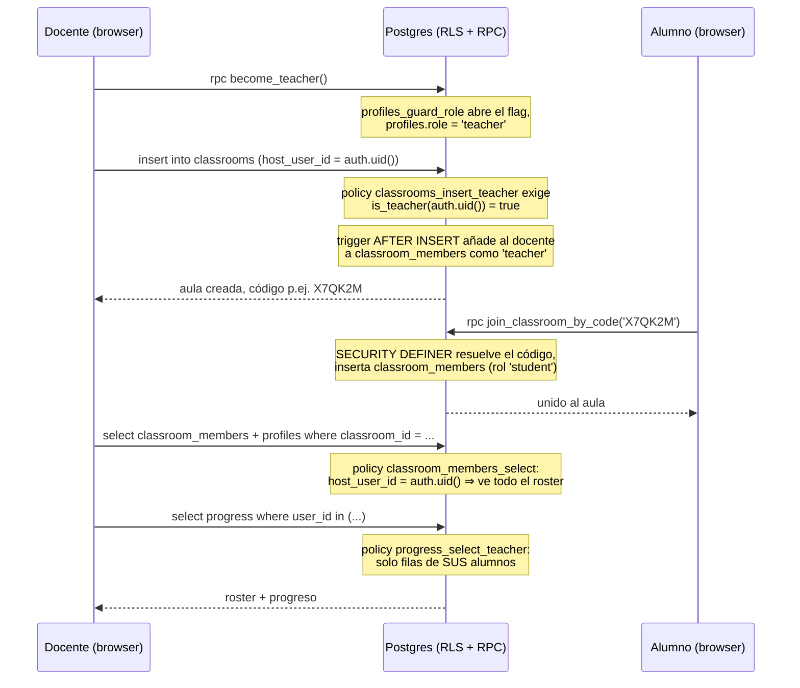

# Auth & Permisos en Qura and Friends

> Cómo se implementó la identidad, la autorización y el control de acceso; qué teoría hay detrás de
> cada decisión; y cómo escalaría esto en un producto real. Pensado tanto como referencia del repo
> como material de portafolio.

## 0. Contexto y modelo de amenazas

Qura and Friends es un juego educativo pensado para **niños jugando en un dispositivo compartido de
aula** (modo hotseat local), sin fricción de login. Eso fija el diseño desde el principio:

- **No hay contraseñas ni verificación de identidad real.** La identidad es *anónima por dispositivo*
  (Supabase Auth, `signInAnonymously`). El sistema no puede — ni pretende — saber si quien juega es
  realmente un niño, un docente o un curioso. Verificar identidad (autenticación fuerte) es un problema
  distinto de decidir qué puede hacer alguien una vez identificado (autorización) — este documento es
  sobre lo segundo.
- **El cliente es hostil por defecto.** Cualquier request puede venir de un DevTools, no solo de la UI.
  Por eso la autorización real nunca vive en React: vive en Postgres (RLS) y en funciones que corren en
  el servidor.
- **El riesgo es bajo pero real:** un "docente" autodeclarado solo gana visibilidad sobre el progreso de
  alumnos que **decidieron unirse a su aula con un código que él generó** — nunca acceso a datos de
  gente fuera de esa relación. El diseño acepta identidad débil (nadie verifica que seas *de verdad*
  profe) a cambio de autorización estricta (aun así, no puedes ver ni tocar nada que no te corresponda).

Esta decisión de diseño — identidad débil + autorización estricta y con alcance mínimo — es el hilo
conductor de todo lo que sigue.

## 1. Las tres capas

```
┌─────────────────────────────────────────────────────────────────────┐
│ 1. AUTENTICACIÓN — ¿quién eres?                                      │
│    Supabase Auth (anónima) → JWT firmado, auth.uid() estable         │
├─────────────────────────────────────────────────────────────────────┤
│ 2. AUTORIZACIÓN POR FILA — ¿puedes tocar ESTA fila?                  │
│    RLS: policies using()/with check() evaluadas por Postgres en      │
│    CADA query, no confiables desde el cliente                        │
├─────────────────────────────────────────────────────────────────────┤
│ 3. AUTORIZACIÓN POR ROL / RELACIÓN — ¿qué CAPACIDAD tienes,          │
│    y con qué recursos de otros usuarios te relacionas?               │
│    RBAC (profiles.role) + relación aula↔alumno (classroom_members),  │
│    mediadas por funciones SECURITY DEFINER cuando cruzan filas       │
│    de otro usuario                                                    │
└─────────────────────────────────────────────────────────────────────┘
```

Las tres capas están desacopladas a propósito: la capa 1 no sabe nada de roles, la capa 2 no sabe nada
de "aulas", la capa 3 se apoya en las dos anteriores. Esto es lo que en teoría de control de acceso se
llama **economía de mecanismo** — cada pieza resuelve una sola pregunta y es fácil de auditar sola.

---

## 2. Capa 1 — Autenticación

| Pieza | Archivo |
|---|---|
| Cliente (browser) | [lib/supabase/client.ts](../apps/web/src/lib/supabase/client.ts) |
| Servidor (SSR / Route Handlers) | [lib/supabase/server.ts](../apps/web/src/lib/supabase/server.ts) |
| Refresco de sesión (middleware) | [lib/supabase/middleware.ts](../apps/web/src/lib/supabase/middleware.ts), [middleware.ts](../apps/web/src/middleware.ts) |
| Bootstrap (sign-in anónimo al cargar la app) | [auth/AuthBootstrap.tsx](../apps/web/src/auth/AuthBootstrap.tsx) |
| Store de identidad (solo lectura, para la UI) | [state/authStore.ts](../apps/web/src/state/authStore.ts) |

`AuthBootstrap` se monta una vez en el layout raíz ([app/layout.tsx](../apps/web/src/app/layout.tsx)) y:

1. Si no hay sesión, llama a `supabase.auth.signInAnonymously()`. Supabase crea una fila en
   `auth.users` y devuelve un JWT (`auth.uid()` = el id de esa fila) que viaja en cookies (SSR) y en
   `localStorage` (browser).
2. Lee `profiles.role` y `profiles.display_name` y los guarda en `useAuthStore` — **solo para pintar
   la UI** (mostrar u ocultar el botón "Crear aula"). Nunca es la fuente de autorización.
3. Se suscribe a `onAuthStateChange` para mantenerse sincronizado si el token se renueva.

El middleware ([middleware.ts](../apps/web/src/middleware.ts)) corre en cada request de servidor y
renueva el access token cuando expira — sin él, un Server Component podría ver `auth.uid() = null` en
mitad de una sesión "activa" porque el token vencido no se refrescó a tiempo.

**Por qué anónima y no un rol fijo tipo `?role=teacher` en la URL:** un JWT anónimo sigue siendo un JWT
firmado por Supabase — nadie puede *fabricar* un `auth.uid()` ajeno, solo Supabase Auth los emite. Eso
es lo único que la capa 2 necesita para funcionar: un identificador en el que se puede confiar, aunque no
sepamos gran cosa sobre la persona detrás.

---

## 3. Capa 2 — RLS (autorización por fila)

Row Level Security ([0002_rls.sql](../supabase/migrations/0002_rls.sql)) es Postgres evaluando, en cada
`SELECT`/`INSERT`/`UPDATE`/`DELETE`, una condición booleana (`using` para lecturas/filtrado,
`with check` para lo que se puede escribir) usando `auth.uid()` — el id que viene *verificado* dentro
del JWT, no un campo que el cliente pueda mandar en el body.

```sql
create policy "progress_own" on public.progress for all
  using (auth.uid() = user_id) with check (auth.uid() = user_id);
```

Dos propiedades hacen que esto sea seguro incluso contra un cliente arbitrario (Postman, curl con la
anon key):

- **Mediación completa** (*complete mediation*, Saltzer & Schroeder 1975): la policy se evalúa en
  *cada* acceso, no solo "al cargar la página" — no hay forma de saltársela cacheando un resultado
  anterior o llamando a la API directo.
- **Default-deny**: una tabla con RLS activado y **sin ninguna policy** rechaza todo. `scores` es el
  ejemplo: hay policy de `select` pero ninguna de `insert`/`update`, así que el cliente físicamente no
  puede escribir puntajes — el único INSERT válido corre en la Edge Function `submit-score` con la
  `service_role` key (nunca expuesta al navegador), que además **revalida el resultado desde cero**
  (recompute de energía QUBO) antes de guardarlo — ver
  [submit-score/index.ts](../supabase/functions/submit-score/index.ts). Es *defensa en profundidad*:
  incluso si alguien lograra hablarle a esa función, todavía tiene que pasar la revalidación.

---

## 4. Capa 3 — RBAC + relación aula↔alumno

RLS por sí sola modela bien "esto es mío" pero no modela bien dos cosas que este feature necesita:

1. Una **capacidad global** ("puedo crear aulas") — eso es un **rol**, no una fila.
2. Una escritura que afecta la fila de **otra persona** ("quiero unirme al aula de código `X7QK2M`") —
   eso no se puede expresar como "esta fila es mía", porque justo antes de escribirla, no lo es.

Todo esto vive en [0004_rbac.sql](../supabase/migrations/0004_rbac.sql).

### 4.1 El rol (`profiles.role`)

```sql
alter table public.profiles
  add column role text not null default 'student' check (role in ('student', 'teacher'));
```

Un `check` constraint (no un `enum` de Postgres) porque un `enum` obliga a una migración con `ALTER
TYPE` para agregar valores nuevos más adelante (p. ej. `'assistant'`); un `check` se reescribe con un
`ALTER TABLE ... DROP CONSTRAINT / ADD CONSTRAINT` normal.

**El problema de la escalada de privilegios.** La policy `profiles_update_own` (0002) deja al usuario
editar *cualquier* columna de su propia fila — `role` incluida. Sin nada más, cualquiera se auto-asigna
`'teacher'` con un `UPDATE` directo. La solución es un trigger que bloquea el cambio salvo que una
puerta explícita lo autorice:

```sql
create function public.profiles_guard_role() returns trigger as $$
begin
  if new.role is distinct from old.role
     and coalesce(current_setting('app.allow_role_change', true), '') <> 'on' then
    raise exception 'role es gestionado por el sistema...';
  end if;
  return new;
end;
$$ language plpgsql;
```

Y la única puerta es `become_teacher()`, una función que abre el flag con `set_config(..., is_local =>
true)` (dura solo esa transacción), hace el `UPDATE`, y lo cierra. El patrón — *"todo cambio a un campo
sensible pasa por una función mediadora que se autoriza a sí misma temporalmente"* — es la versión en
SQL puro de lo que Unix hace con `setuid`: el proceso llamador nunca tiene el privilegio, solo lo toma
prestado durante una operación acotada y auditable.

### 4.2 Por qué `SECURITY DEFINER` no es "una key mágica"

`become_teacher()` y `join_classroom_by_code()` están marcadas `security definer`. Es un detalle fácil
de malentender: **`SECURITY DEFINER` no salta RLS por sí sola.** Lo que salta RLS es que, en Supabase,
las migraciones corren como el rol `postgres`, que es el **dueño** de las tablas — y Postgres exime al
dueño de una tabla de sus propias políticas de RLS (a menos que se declare `FORCE ROW LEVEL SECURITY`).
`SECURITY DEFINER` es lo que hace que la función se ejecute *con los privilegios de quien la creó*
(`postgres`) en vez de con los privilegios de quien la *llama* (el usuario anónimo) — esa combinación es
la que produce el efecto de "puerta controlada".

Es exactamente el mismo principio, a otro nivel, que ya usa `submit-score`: el cliente nunca recibe la
`service_role` key; en su lugar, llama a una función de servidor que sí la tiene y que decide, con
lógica propia, si la escritura es válida. Aquí no hace falta una Edge Function porque la decisión
("¿el código coincide con un aula?") se puede resolver enteramente dentro de Postgres — pero el
principio de **mediación por un tercero de confianza** (*trusted subsystem*, y su contraparte, evitar el
[problema del "confused deputy"](https://en.wikipedia.org/wiki/Confused_deputy_problem)) es idéntico.

```sql
create function public.join_classroom_by_code(p_code text)
returns table (classroom_id uuid, classroom_name text)
security definer set search_path = public
language plpgsql as $$
declare v_classroom record;
begin
  select id, name into v_classroom from public.classrooms where code = upper(trim(p_code));
  if not found then raise exception 'código de aula inválido'; end if;
  insert into public.classroom_members (classroom_id, user_id, role_in_classroom)
  values (v_classroom.id, auth.uid(), 'student')
  on conflict on constraint classroom_members_pkey do nothing;  -- ver §4.6, por qué no un column list
  return query select v_classroom.id, v_classroom.name;
end; $$;
```

Nótese `set search_path = public`: sin fijarlo, una función `SECURITY DEFINER` es vulnerable a que
alguien con permisos de crear objetos en otro schema del *search path* le "esconda" una tabla o función
con el mismo nombre y la ejecute con privilegios de `postgres` — un ataque de secuestro de
`search_path` clásico en Postgres. Fijarlo es barato y cierra esa puerta.

`classroom_members` **no tiene ninguna policy de `insert`** — es intencional: una policy fila-a-fila no
puede validar "¿el código que dice tener el cliente corresponde a este `classroom_id`?" porque en el
momento de decidir el INSERT, el código no es una columna de la fila que se está insertando. Un RPC sí
puede: recibe el código, resuelve el `classroom_id` él mismo, y entonces decide. Cuando una regla de
negocio no se puede expresar como "¿esta fila cumple una condición?", la señal es que necesita una
función, no una policy más elaborada.

### 4.3 RBAC (rol global) vs. la relación aula↔alumno (más cerca de ReBAC)

`classroom_members.role_in_classroom` es deliberadamente una columna distinta de `profiles.role`:

- `profiles.role = 'teacher'` responde **"¿tiene esta persona la capacidad de crear aulas?"** — un rol
  *global*, clásico RBAC (Role-Based Access Control).
- `classroom_members.role_in_classroom` responde **"¿qué es esta persona DENTRO de ESTA aula
  concreta?"** — el permiso depende de la *relación* con un recurso específico, no solo de un rol
  global. Esto es más cercano a ReBAC (*Relationship-Based Access Control*, el modelo detrás de sistemas
  como Google Zanzibar): "puedes ver el progreso de X" no es una propiedad de tu cuenta, es una
  propiedad de la arista `(tú) --enseña--> (aula) <--pertenece-- (X)` en el grafo de relaciones.

Hoy ambos coinciden siempre (quien crea el aula es su único `'teacher'`), así que en la práctica actual
`role_in_classroom` solo tiene el valor `'teacher'` en la fila que el trigger
`classrooms_add_host_membership` inserta automáticamente al crear el aula. Separarlos desde ahora es lo
que deja espacio, sin rediseñar el esquema, a cosas como co-docentes o auxiliares con permisos distintos
dentro de una misma aula (§6).

La policy de lectura de `progress` para docentes usa exactamente ese grafo de relaciones:

```sql
create policy "progress_select_teacher" on public.progress for select
  using (exists (
    select 1 from public.classroom_members m
    join public.classrooms c on c.id = m.classroom_id
    where m.user_id = progress.user_id and c.host_user_id = auth.uid()
  ));
```

Postgres combina las policies permisivas de un mismo comando con **OR**: esta se suma a `progress_own`
(0002), así que un alumno lee la suya por una regla y su docente la de todos sus alumnos por otra —
ninguna de las dos policies necesita saber que la otra existe.

### 4.4 Diagrama: crear aula → alumno se une → docente lee progreso



### 4.5 Un bug real: recursión en RLS entre dos tablas

Al probar esto contra el proyecto de verdad, `select * from classrooms` empezó a fallar con:

```
ERROR: infinite recursion detected in policy for relation "classrooms"
```

La causa: `classrooms_select_member` (en `classrooms`) hace `EXISTS (... from classroom_members ...)`. Para
resolver esa subconsulta, Postgres necesita aplicarle a `classroom_members` SUS policies — y
`classroom_members_select` hace `EXISTS (... from classrooms ...)` de vuelta, que otra vez necesita
evaluar `classrooms_select_member`. Dos tablas cuyas policies de `SELECT` se consultan mutuamente no son
un caso especial raro — es la forma más directa de expresar "puedo ver el aula si soy miembro" + "puedo
ver el miembro si soy dueño del aula" — y ese par, tal cual, ya es un ciclo.

El arreglo ([0005_fix_rls_recursion.sql](../supabase/migrations/0005_fix_rls_recursion.sql)) mueve cada
subconsulta a una función `SECURITY DEFINER`:

```sql
create function public.is_classroom_member(p_classroom_id uuid, p_uid uuid) returns boolean
language sql security definer set search_path = public stable as $$
  select exists (select 1 from public.classroom_members m
                 where m.classroom_id = p_classroom_id and m.user_id = p_uid);
$$;
```

La lectura de `classroom_members` **dentro** de esta función corre con los privilegios de su dueño
(`postgres`, que también es dueño de la tabla) — y un dueño de tabla está exento de sus propias policies
de RLS por defecto. Esa lectura ya no dispara la policy de `classroom_members`, así que no hay nada que
recursivamente vuelva a pedir la policy de `classrooms`. El ciclo se corta ahí, no reescribiendo la
lógica de negocio (que sigue siendo exactamente la misma: "dueño o miembro").

Vale la pena dejarlo documentado porque es un caso general, no una rareza de este esquema: **cualquier
par de policies en tablas distintas que se consultan mutuamente es candidato a este error**, y la señal
de alarma es reconocible de antemano — si escribís la policy de A pensando "para esto necesito mirar B"
y la de B fue "para esto necesito mirar A", ya hay un ciclo antes de correr una sola query.

### 4.6 Otro bug real: columna ambigua por el nombre del `RETURNS TABLE`

Al probar el flujo de "unirse a un aula" de verdad (crear un aula y unirse desde otra sesión), el join
falló con:

```
ERROR: column reference "classroom_id" is ambiguous
```

La causa es un gotcha clásico de PL/pgSQL, distinto del de RLS: `join_classroom_by_code` está declarada
como `returns table (classroom_id uuid, classroom_name text)`. Eso no es solo el nombre de las columnas
de salida — **convierte `classroom_id` en una variable visible en todo el cuerpo de la función**, al
mismo nivel que cualquier `declare`. Más abajo, el INSERT hacía:

```sql
on conflict (classroom_id, user_id) do nothing;
```

y ahí `classroom_id` quedó ambiguo: ¿la variable de retorno de la función, o la columna de
`classroom_members`? Postgres no puede decidir y aborta. No apareció al probarlo por API la primera vez
porque esa prueba nunca disparó el `ON CONFLICT` (nadie más se había unido todavía) — con un segundo
usuario uniéndose a una fila que el trigger de bienvenida del docente ya insertó, el conflicto sí ocurre
y ahí explota.

El arreglo ([0006_fix_join_ambiguous_column.sql](../supabase/migrations/0006_fix_join_ambiguous_column.sql))
apunta el conflicto por el **nombre de la constraint** en vez de por lista de columnas:

```sql
on conflict on constraint classroom_members_pkey do nothing;
```

Esa forma no menciona ningún identificador de columna suelto, así que no hay nada que colisione con la
variable. Regla general para evitar esto de entrada: en cualquier función PL/pgSQL, si un parámetro o un
`RETURNS TABLE` comparte nombre con una columna real de una tabla que la función toca, es candidato a
esto — vale la pena revisar los nombres antes de escribir el cuerpo, no después de que falle.

---

## 5. Teoría aplicada (resumen)

| Principio / modelo | Dónde aparece en el repo |
|---|---|
| **Autenticación ≠ Autorización** | Identidad anónima ([AuthBootstrap.tsx](../apps/web/src/auth/AuthBootstrap.tsx)) + autorización estricta en Postgres |
| **DAC** (Discretionary Access Control) | `profiles_own`, `progress_own`, `board_sessions_own` — el dueño de la fila decide vía la app quién más la ve (nadie, en este caso: no hay "compartir") |
| **RBAC** (Role-Based Access Control) | `profiles.role`, `is_teacher()`, gate en `classrooms_insert_teacher` |
| **ReBAC** (Relationship-Based Access Control) | `classroom_members` como grafo docente↔aula↔alumno; `progress_select_teacher` |
| **Principio de mínimo privilegio** | `is_teacher()` es `SECURITY INVOKER` (no necesita más privilegio del que ya tiene cualquier lector); `submit-score` es la ÚNICA ruta con `service_role` |
| **Mediación completa** (Saltzer & Schroeder) | RLS se re-evalúa en cada query; no hay "sesión con permisos cacheados" |
| **Fail-safe defaults** (RLS default-deny) | `scores` y `classroom_members` sin policy de insert ⇒ deniegan por defecto |
| **Separación de responsabilidades** | Autenticación (Supabase Auth) / autorización por fila (RLS) / autorización por rol (RBAC+RPCs) son tres mecanismos independientes que se componen |
| **Trusted subsystem / anti "confused deputy"** | Funciones `SECURITY DEFINER` con `search_path` fijo como único camino para mutar datos ajenos |
| **Defensa en profundidad** | RLS en la tabla + revalidación de negocio en la función (`join_classroom_by_code` no confía en que el código "suene bien", lo resuelve contra la tabla real; `submit-score` no confía en el score, recomputa la energía) |
| **Least astonishment en el cliente** | `useAuthStore.role` es solo para UI — documentado explícitamente para que nadie, en un refactor futuro, lo use como si fuera la autorización real |

---

## 6. Cómo escalaría esto en producción

Ordenado aproximadamente de "lo haría antes de lanzar con usuarios reales" a "lo haría si el producto
crece mucho":

1. **Identidad real para docentes.** Auth anónima está bien para alumnos, pero un docente que administra
   un aula real querría no perder su cuenta al borrar cookies. Camino natural con Supabase: `linkIdentity`
   para "elevar" la sesión anónima a un login con email/magic-link *sin perder el `auth.uid()`* (y por
   tanto sin perder sus aulas ya creadas). Para un despliegue institucional, SSO (Google Workspace for
   Education / SAML) sería el siguiente paso — ahí sí se podría verificar "es de verdad profesor de este
   colegio" antes de conceder el rol, en vez del `become_teacher()` autoservicio actual.
2. **Rol en el JWT, no en una tabla.** Hoy `is_teacher()` hace una lectura a `profiles` en cada policy
   que la usa. Para escalar performance, Supabase permite un *Custom Access Token Hook* que copie
   `profiles.role` a un claim del JWT (`auth.jwt() ->> 'role'`) al emitir el token — las policies pasan
   de un `EXISTS` con JOIN a una comparación de string, sin round-trip. El costo es que el rol queda
   "congelado" hasta que el token se refresca; para este dominio (roles que cambian con poca frecuencia)
   es un buen trade-off.
3. **Auditoría.** Una tabla `audit_log(actor_id, action, target_table, target_id, at)` alimentada desde
   las funciones `SECURITY DEFINER` (`become_teacher`, `join_classroom_by_code`) — barato de añadir
   porque ya son el único punto de paso de esas acciones, y da trazabilidad real para soporte/disputas
   ("¿quién se unió a mi aula y cuándo?").
4. **Rate limiting / anti-abuso.** `join_classroom_by_code` no tiene límite de intentos hoy — alguien
   podría fuerza-bruta probar códigos de 6 caracteres. Con `pg_cron` + una tabla de intentos, o con
   rate limiting en el borde (Supabase Edge Functions / Cloudflare), se cerraría. El espacio de códigos
   (32^6 ≈ 10^9) hace esto de baja prioridad para el tamaño actual, pero es lo primero que rompería con
   tráfico real.
5. **Co-docentes y roles intra-aula más ricos.** `classroom_members.role_in_classroom` ya está separado
   de `profiles.role` justamente para esto: añadir `'assistant'` (ve el roster, no puede borrar el aula)
   es un `check` constraint nuevo + una policy nueva, sin tocar el resto del modelo.
6. **ABAC para reglas más finas.** Ejemplos que dejarían de caber en "rol + relación": códigos de aula
   con expiración, aulas archivadas de solo-lectura, límite de alumnos por aula gratuita vs. de pago. El
   patrón natural es Attribute-Based Access Control — condiciones sobre atributos de la fila
   (`classrooms.expires_at`, `classrooms.plan`) dentro de la misma policy, sin nuevas tablas.
7. **Tests de RLS en CI.** [pgTAP](https://pgtap.org/) permite escribir tests que se autentican como
   distintos `auth.uid()` simulados y verifican que una policy deniega/permite lo esperado — hoy estas
   policies solo están probadas manualmente. Es la pieza que más valdría la pena añadir a continuación:
   un cambio futuro en una policy que rompa el aislamiento entre alumnos se detectaría en CI, no en
   producción.

---

## 7. Cómo probarlo localmente

```bash
# Requiere Supabase CLI (no incluida en este repo/entorno de desarrollo)
supabase start                 # levanta Postgres + Auth + Realtime local
supabase migration up          # aplica 0001…0004 en orden
cp .env.example apps/web/.env.local   # y completa con las keys que imprime `supabase start`
pnpm dev
```

Prueba manual mínima de RBAC: entra a `/aula` en dos pestañas (dos sesiones anónimas distintas), crea un
aula en la primera, copia el código, únete desde la segunda, y confirma que el docente ve al alumno en el
roster pero el alumno no puede ver el roster de la pestaña del docente (RLS se lo impide aunque conozca
el `classroom_id`).

## 8. Archivos de esta feature

- `supabase/migrations/0004_rbac.sql` — el esquema (fuente de verdad de la autorización)
- `supabase/migrations/0005_fix_rls_recursion.sql` — corrige la recursión de RLS entre `classrooms` y `classroom_members` (§4.5)
- `supabase/migrations/0006_fix_join_ambiguous_column.sql` — corrige la columna ambigua en `join_classroom_by_code` (§4.6)
- `apps/web/src/middleware.ts`, `apps/web/src/lib/supabase/middleware.ts` — refresco de sesión SSR
- `apps/web/src/auth/AuthBootstrap.tsx`, `apps/web/src/state/authStore.ts` — identidad en el cliente
- `apps/web/src/lib/supabase/classrooms.ts` — acceso a datos (RPCs + queries), separado de la UI
- `apps/web/src/app/(learn)/aula/page.tsx` — UI del dashboard docente / unirse por código
- `packages/schemas/src/index.ts` — `RoleSchema`, `ClassroomCodeSchema` (validación de UX, no de seguridad)
